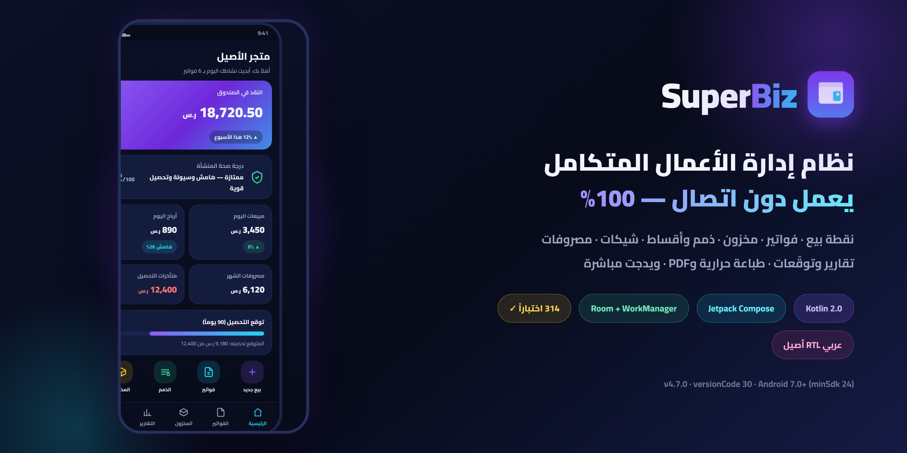

# SuperBiz

**Version: V 1.5.0**
**ZATCA مرحلة-2 — جاهز-للربط**




-3B82F6?style=flat-square&labelColor=0B1026)


---

> ⬇️ **تحميل جاهز للتثبيت:** حزمة **APK موقّعة** (وأيضًا AAB للمتجر) متاحة مباشرةً من [إصدار V 1.5.0](https://github.com/CTO-DRS/SuperBiz/releases/tag/v1.5.0) — تُبنى وتُوقّع وتُرفق آليًا مع كل وسم `v*` عبر GitHub Actions.

## وصف المشروع

SuperBiz هو تطبيق أندرويد أصلي (Native) لإدارة الأعمال الصغيرة والمتوسطة، يجمع في تطبيق واحد: نقطة البيع، الفواتير، المخزون، الذمم، الأقساط، الشيكات، المصروفات، التقارير، كشوف الحساب، الطباعة الحرارية والـPDF، والويدجت — وكل ذلك يعمل **دون اتصال بالإنترنت 100%**.

- **المنصة:** Android Native
- **اللغة:** Kotlin + Jetpack Compose (Material 3)
- **الواجهة:** العربية أولًا (RTL أصيل) مع دعم إنجليزي كامل (2235 نصًا × لغتين بتطابق تام)
- **قاعدة البيانات:** Room (مخطط v12 — 25 جدولًا بمفاتيح أجنبية كاملة، المال مخزَّن Long قروش)
- **الاختبارات:** 1593 اختبار وحدة أخضر في 131 ملف اختبار
- **الحجم:** 190 ملف Kotlin (~67 ألف سطر) · 29 شاشة Compose · 17 مستودع بيانات · 57 ملف محركات ومنطق نق Pure

## الهدف من التطبيق

تمكين صاحب العمل الصغير من إدارة متجره بالكامل من هاتفه دون خادم، دون اشتراك سحابي، ودون اتصال إنترنت إجباريًا: بيع وتحصيل ومحاسبة قيد مزدوج وفوترة متوافقة مع متطلبات الفوترة الإلكترونية (ZATCA) وتقارير تدعم القرار — مع بقاء كل البيانات **على جهاز المستخدم فقط**.

## المميزات (كما وُجدت فعليًا في هذا الإصدار)

| المجال | التفاصيل |
|---|---|
| **نقطة البيع (POS)** | سلة ذكية، بيع حر، باركود (توليد + مسح ZXing)، خصومات سلة/سطر، كوبونات خصم، استبدال نقاط ولاء، طرق دفع متعددة، إيصال حراري |
| **الفواتير** | بيع/آجل/مرتجع، ترقيم تسلسلي من قاعدة البيانات داخل المعاملة، إلغاء آمن يعكس أثره، PDF متعدد الصفحات، حقول ضريبية على مستوى السطر (قياسية/صفرية/معفاة + نسبة صريحة) |
| **المخزون** | حركات مخزنية ذرّية داخل معاملة Room، تنبيه مخزون منخفض، أرشفة منتجات، مسح باركود، تحليلات ذكية |
| **الذمم** | دائنة/مدينة، تقادم الذمم (Aging)، تذكيرات آلية، رقائق تحصيل، كشف حساب لكل طرف |
| **الأقساط** | خطط أقساط بجدولة بلا قسط أخير سالب، تحصيل جزئي/كامل، تسوية سداد مبكر |
| **الشيكات** | واردة/صادرة، حالات (نقد/ارتجاع/رجوع)، أرشفة المسدد، تقويم استحقاق + تصدير ICS |
| **المصروفات** | تصنيفات، حد شهري مع إنذار، قوالب مصروفات |
| **التقارير** | مبيعات/أرباح/تدفق نقدي/ضريبة دورية، رسوم بيانية Compose، دفتر تفصيلي عميق، مصنف XLSX متعدد الأوراق (كاتب مدمج مطابق ISO 29500)، تصدير CSV بترميز UTF-8-BOM |
| **كشوف الحساب PDF** | محرك 50 قالبًا (10 فئات) بترقيم صفحات وRTL/ثنائي اللغة، Template Studio (بحث/فئات/مفضلة/تحرير)، إرسال بريد SMTP، جدولة تلقائية بمحرك قواعد، سجل تسليمات، شاشة تحقق برقم وبصمة SHA-256 |
| **الضريبة (ZATCA)** | QR ضريبي مرحلة-1 على فواتير PDF والإيصالات الحرارية، **مرحلة-2 جاهزة-للربط**: هوية UUID/ICV/PIH تُختم داخل معاملة الحفظ + مولّد UBL 2.1 رسمي (قياسية/دائنة/مدينة بفئات S|Z|E) مؤرشف لكل فاتورة + مولّد CSR رسمي + قائمة إبلاغ/تخليص معزولة feature-gated (لا socket قبل تفعيل صريح) + لوحة حالات الربط، تقرير ضريبة دوري |
| **الولاء والكوبونات** | نقاط تُكسب على المبيعات وتُستبدل خصمًا داخل معاملة حفظ الفاتورة الذرّية، كوبونات ثابتة أو نسبية، إدارة من الإعدادات |
| **فريميوم Pro** | شراء لمرة واحدة عبر Play Billing v7 بلا خادم (شراء/استعادة/إقرار فوري)، لوحة المؤشرات KPIs كباب Pro أول (مبيعات/ربح/مصروفات/متأخر مقابل أهداف) |
| **الطباعة** | طابعات حرارية Bluetooth (ESC/POS بتشكيل عربي كامل وترتيب RTL بصري) + PDF A4 عبر PrintFramework + مشاركة |
| **الويدجت (4)** | ذمم القبض · مبيعات اليوم · النقد في الصندوق · مخزون منخفض |
| **الأمان** | PIN مشتق PBKDF2-600k ملفوف بـ AndroidKeyStore AES-256-GCM، بصمة/وجه، قفل تدريجي عند المحاولات، إعادة مصادقة للتغييرات الحساسة، حجب لقطات الشاشة، وضع خصوصية يطمس المبالغ |
| **النسخ الاحتياطي** | تصدير/استيراد JSON كامل 25/25 جدولًا بتحقق سلامة واستعادة دمجية أو استبدال، نسخ تلقائي مجدول (1/3/7/30 يوماً) بإشعار فشل صريح |
| **إضافات الإنتاجية** | بحث شامل في كل الشاشات، مفضلات بموقع جغرافي وسجل زيارات وترتيب «الأقرب أولًا»، شاشة أذونات مركزية، فحص صحة بيانات، لوحات رؤى مخصصة قابلة للتكييف في 8 شاشات، +40 خوارزمية تحليلية (تنبؤ، أعمار ذمم، أزواج شراء، رصد شواذ — إحصاء محلي بلا أي مكتبات AI/ML) |

## أهم الوظائف من الداخل

| الوحدة | الآلية |
|---|---|
| **نقطة البيع** | سلة في الذاكرة → خصم مخزون ذرّي داخل معاملة Room واحدة → رقم فاتورة تسلسلي من قاعدة البيانات نفسها |
| **المحاسبة** | قيد مزدوج مفروض التوازن (`totalDebit == totalCredit` مساواة تامة) قبل أي حفظ؛ المال Long قروش |
| **الولاء** | كل الكسب/الاستبدال/استهلاك الكوبون داخل معاملة حفظ الفاتورة — الإلغاء يكتب تعويضًا بصفي VOID |
| **النسخ الاحتياطي** | كتابة ذرّية بحد 50MB، قواعد يتيمة بنيوية، ولا يحمل ملف النسخة أي حالة قفل أمنية |
| **الويدجت** | AppWidgetProvider يقرأ من مستودعات Room مباشرة مع زر تحديث مستهدف |

## متطلبات التشغيل

- Android 7.0 فأحدث (minSdk 24 — targetSdk/compileSdk 36)
- لا حساب، لا اتصال إنترنت، لا صلاحيات إجبارية — الأذونات (جهات الاتصال/التخزين/التنبيهات الدقيقة/الموقع/البلوتوث) اختيارية تُفعَّل من شاشة الأذونات داخل التطبيق عند الحاجة
- الطباعة الحرارية تحتاج طابعة Bluetooth متوافقة ESC/POS

## متطلبات البناء

| الأداة | النسخة |
|---|---|
| JDK | 17 (مصفوفة CI تشمل 17 و21) |
| Android SDK | Platform 36 + Build-Tools 35 |
| Kotlin | 2.0.21 |
| Android Gradle Plugin | 8.9.2 |
| Gradle | 8.11.1 (Wrapper مرفق) |
| KSP | 2.0.21-1.0.27 |

**مكتبات التشغيل:** Compose BOM 2024.10.01 · core-ktx 1.13.1 · appcompat 1.7.0 · activity-compose 1.9.3 · lifecycle 2.8.6 · navigation-compose 2.8.3 · Room 2.6.1 · WorkManager 2.9.1 · DataStore 1.1.1 · biometric-ktx 1.2.0-alpha05 · coroutines 1.8.1 · ZXing 3.5.3 / embedded 4.3.0 · billing-ktx 7.1.1

**مكتبات الاختبار:** JUnit 4.13.2 · coroutines-test 1.8.1 · Robolectric 4.13 · androidx.test core-ktx 1.6.1 · junit-ktx 1.2.1 · ui-test-junit4 · work-testing 2.9.1

> قاعدة صارمة في المشروع: **لا مكتبات AI/ML إطلاقًا** — كل التحليلات إحصاء محلي نقي.

## طريقة بناء المشروع

### عبر Android Studio (الأسهل)
1. افتح Android Studio حديثًا (يدعم AGP 8.9) → `File → Open` → مجلد `SuperBiz`.
2. انتظر مزامنة Gradle (يُنشأ `local.properties` تلقائيًا).
3. `Run ▶` أو `Build → Generate Signed Bundle/APK`.

### عبر سطر الأوامر
```bash
# المتطلبات: JDK 17 + Android SDK (platform 36)
./gradlew assembleDebug            # APK تجريبي → app/build/outputs/apk/debug/
./gradlew assembleRelease          # APK إصدار (يتطلب توقيعًا — انظر أدناه)
./gradlew bundleRelease            # AAB للمتجر
./gradlew testReleaseUnitTest      # 1593 اختبار وحدة
```

> ملاحظة: أول تشغيل يحمّل اعتماديات Gradle/Maven — يلزم اتصال إنترنت مرة واحدة فقط؛ التطبيق نفسه يعمل دون اتصال تمامًا.

### توقيع نسخة الإصدار
1. انسخ `keystore.properties.example` إلى `keystore.properties` واملأ مسار مخزن المفاتيح وكلمات السر (مفاتيح التوقيع الفعلية **مستبعدة عمدًا** من المستودع عبر `.gitignore`).
2. `./gradlew assembleRelease` — سيُوقَّع الـAPK تلقائيًا.
3. عند غياب `keystore.properties` يُبنى `app-release-unsigned.apk` غير موقَّع.

## طريقة تثبيت التطبيق

1. من صفحة [Releases](../../releases) حمّل أحدث APK موقَّع — للإصدار الحالي: [`app-release.apk` من إصدار V 1.5.0](https://github.com/CTO-DRS/SuperBiz/releases/tag/v1.5.0) (تُبنى الحزم وتُوقَّع آليًا عند كل وسم `v*` عبر `.github/workflows/release.yml`، والشهادة: `SuperBiz / CTO-DRS`).
2. على الهاتف: اسمح بـ«التثبيت من مصادر غير معروفة» لهذا الملف ثم ثبّته.
3. افتح التطبيق — يعمل فورًا دون تسجيل أو اتصال. كل البيانات تبقى على جهازك فقط.
4. الترقيات المستقبلية فوق V 1.0.0 تراكبية بنفس شهادة التوقيع (وحتى V 1.5.0 تحفظ كل البيانات على مخطط v14) — بلا فقد بيانات. خذ نسخة احتياطية من داخل التطبيق قبل أي ترقية كإجراء وقائي.

## بنية المشروع (مختصرة)

```
SuperBiz/
├── app/src/main/java/com/superbiz/app/
│   ├── ui/          29 شاشة Compose + التنقل + المكونات المشتركة + الثيم
│   ├── vm/          ViewModels (AppVM + رؤى الشاشات + ProVM) + حرس السلامة
│   ├── data/        Room: مخطط v12 (25 جدولًا) + 17 مستودعًا + DAOs + Billing/ProStore
│   ├── domain/      محركات نقية: محاسبة، أقساط، سلة POS، كشوف، ZATCA، ولاء، KPIs، تحليلات
│   ├── pdf/ print/ export/   PDF A4 + طباعة ESC/POS + تصدير XLSX/CSV
│   ├── security/    PIN/PBKDF2 + AndroidKeyStore + بصمة + قفل تدريجي
│   ├── widget/      4 ويدجت AppWidgetProvider
│   ├── work/        عمال الخلفية: أتمتة، نسخ احتياطي، جدولة تقارير، تذكيرات
│   └── util/        Money (HALF_UP) + Intents آمنة + توليد باركود
├── app/src/test/    131 ملف اختبار — 1593 اختبار وحدة
├── app/schemas/     مخططات Room المصدَّرة (مرجع اختبارات الترحيل)
├── docs/            التوثيق: ADR، ZATCA-2، RBAC، أمان، خصوصية، متجر، عمليات
├── tools/ scripts/  فاحصات CI للسلاسل الموطَّنة
└── .github/workflows/   CI (بناء + اختبارات + مصفوفة JDK 17/21) + حلقة نشر آلية عند الوسوم
```

## المساهمة

هذا مستودع عام للعرض والاطلاع ومملوك لمالكه، والمساهمة الخارجية غير متاحة حاليًا. إن كنت من فريق العمل: أنشئ فرعًا من `main`، واظب على نجاح `testReleaseUnitTest` وفاحص السلاسل (`tools/check_strings_format.py`) قبل فتح Pull Request، ووثّق أي ميزة جديدة في `CHANGELOG.md`.

## معلومات الترخيص والملكية

جميع الحقوق محفوظة © 2026 CTO-DRS — المستودع متاح للعرض العام فقط، ولا يُمنح أي ترخيص لإعادة التوزيع أو الاستخدام التجاري خارج نطاق مالكه دون إذن كتابي. المتطلبات القانونية للنشر على Google Play موثقة في [`docs/PRIVACY_POLICY.md`](docs/PRIVACY_POLICY.md) و[`docs/PLAY_DATA_SAFETY.md`](docs/PLAY_DATA_SAFETY.md).

## معلومات الإصدار

| البند | القيمة |
|---|---|
| الإصدار | **V 1.5.0 — ZATCA مرحلة-2 (جاهز-للربط)** |
| versionCode | 1 |
| تاريخ الإصدار | 2026-10-06 |
| الوسم | `v1.5.0` |
| رقم الإصدار داخل التطبيق | يُعرض من `BuildConfig.VERSION_NAME` في مركز الإعدادات (حول) وتذييل كل مستندات PDF — لا يوجد أي رقم إصدار صلب في الكود |

## فهرس التوثيق

| الملف | المحتوى |
|---|---|
| [`CHANGELOG.md`](CHANGELOG.md) | سجل هذا الإصدار الرسمي |
| [`ROADMAP.md`](ROADMAP.md) | خارطة ما بعد V 1.0.0 |
| [`docs/ALGORITHMS.md`](docs/ALGORITHMS.md) | دليل عقود الخوارزميات التحليلية |
| [`docs/ADR-001_NETWORK_LAYER.md`](docs/ADR-001_NETWORK_LAYER.md) | قرار معماري: طبقة الشبكة المعزولة (للموجة القادمة) |
| [`docs/ZATCA2_GAP_ANALYSIS.md`](docs/ZATCA2_GAP_ANALYSIS.md) · [`docs/ZATCA2_WAVE2_PLAN.md`](docs/ZATCA2_WAVE2_PLAN.md) | فجوات وخطة الربط الرسمي مع ZATCA |
| [`docs/RBAC_V13_DESIGN.md`](docs/RBAC_V13_DESIGN.md) | تصميم تعدد المستخدمين والأدوار (مؤجل) |
| [`docs/SECURITY_EVAL.md`](docs/SECURITY_EVAL.md) | تقييم أمان قاعدة البيانات |
| [`docs/PRIVACY_POLICY.md`](docs/PRIVACY_POLICY.md) · [`docs/PLAY_DATA_SAFETY.md`](docs/PLAY_DATA_SAFETY.md) · [`docs/STORE_LISTING_ASO.md`](docs/STORE_LISTING_ASO.md) | وثائق النشر على المتجر |
| [`docs/LAUNCH_RUNBOOK_W1.md`](docs/LAUNCH_RUNBOOK_W1.md) | دفتر الإطلاق التشغيلي |
| [`docs/ops/`](docs/ops/) | حزمة العمليات: سياسة الخصوصية العامة، المختبرون، خط أساس الأداء |
